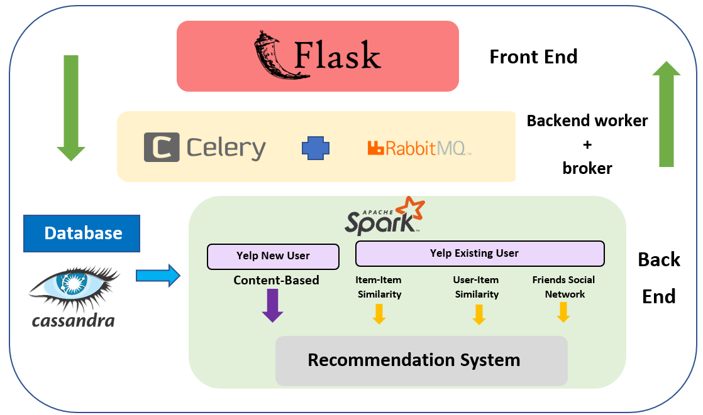
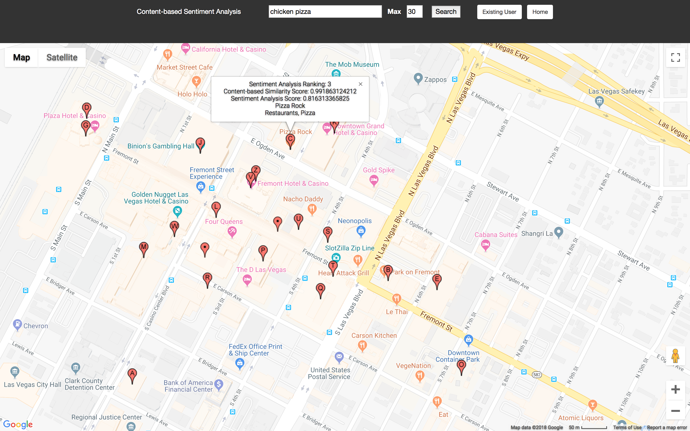
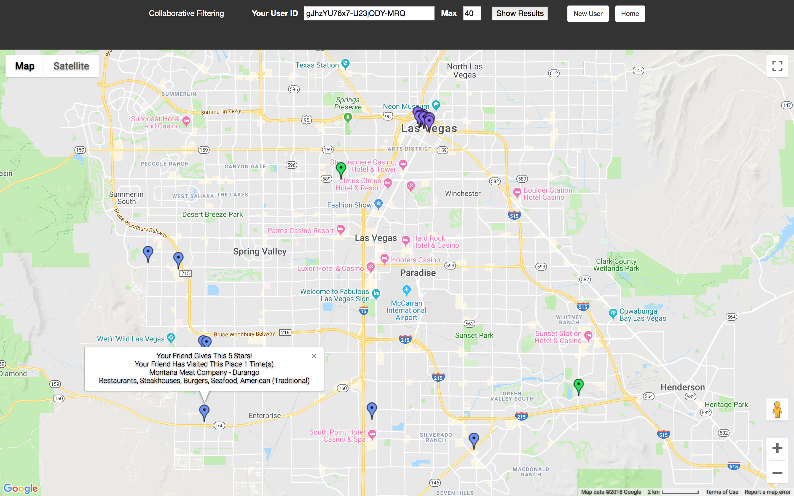
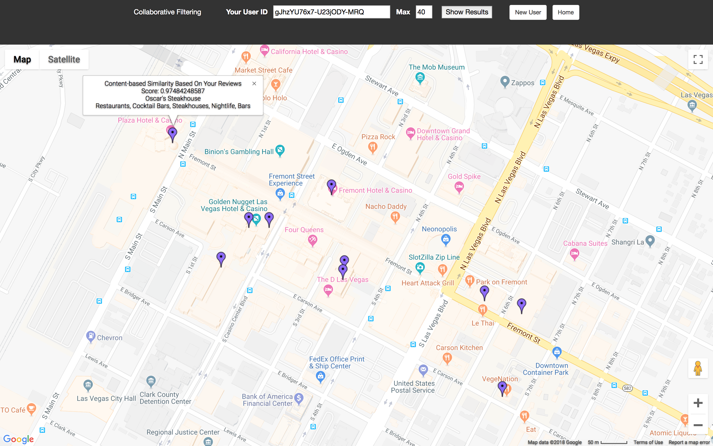
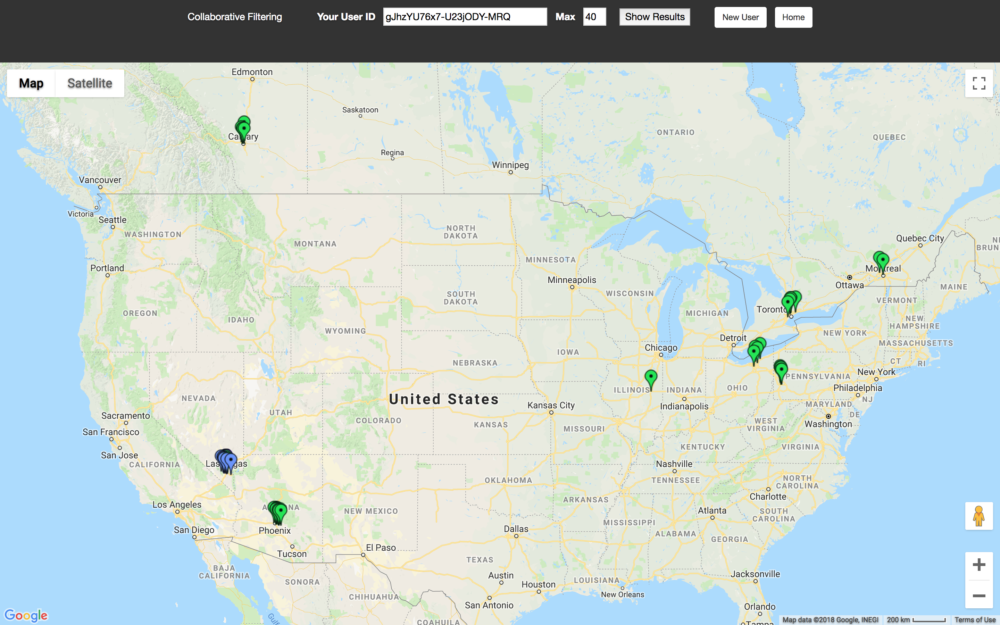

# CMPT732-Project-YelpRanking
Group member: **Mak Hoi Victor HAU**, **Yunhye JOO**, **Denise CHEN**
## Architecture of Recommendation System:

## Web Application Screenshots
Content-based Sentiment Analysis:

Collaborative Filtering:

## Introduction:
We bulid a recommendation system targeted on Yelp new users and Yelp existing users respectively. Regarding the system for yelp new users, new users can input flexible and complicated 
keywords such as "Taco Lunch", "Cafe Friends". Then, the website would output restaurants with its reviews matching with the keywords most and high sentiment score.
As for recommendation system for Yelp existing users, they just simply input user ID and the website would output 3 results through item-item similarity, user-item similarity, and friends 
social network.
## Recommendation Systems:
Different methods of a recommender system:    
    **1. Content-Based Recommender:** focus on properties of items. To solve the cold-start problem, we added recommendation by key words search. We feed each word of review into vectors.
    Similarity of items is determined by measuring the similarity in the properties. We use 2 methods of content-based and compare the performance of similarity score through cosine-similarity formula.   
* TFIDF-LDA  (Output topics from the vector of words)
- Word2Vec (Neural network to place similar words together with nearby vextor space)

**2. Item-item similarity:** recommend based on the most similar items found by restaurants' reviwes. These restaurant reviews are selected for restaurants visited by the user before.  

**3. User-item similarity:** recommend the restaurants based on similar type of restaurants visited by other users.
* Alternating Least Square (ALS) --Matrix factorization to compose large user/item matrix into lower dimensional user and item factors.

**4. Friends social network:** choose to recommend restaurants as being top ranked by user's friends (4 or 5 stars).

## Visualization:
Tableau public : https://public.tableau.com/views/YelpDatasetVisualization/Dashboard1?:embed=y&:display_count=yes

## Problems:
We aren't able to upload the saved model and data since the data size exceeds the gitlab's limit of 10mb
